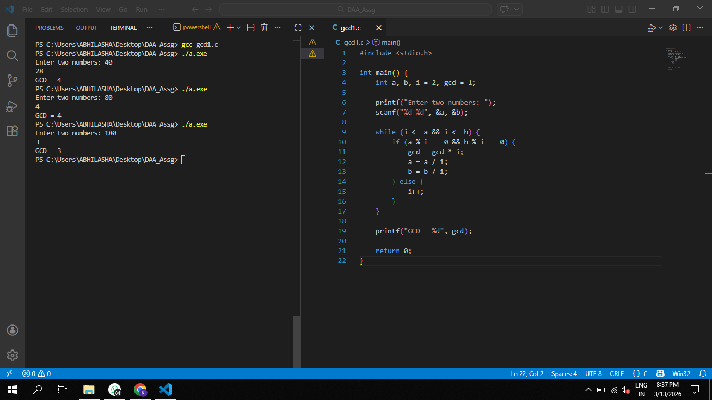

# GCD using Middle School Algorithm

## Objective

To implement a program that computes the Greatest Common Divisor (GCD) of two numbers using the Middle School Algorithm and analyze its running time.

## Algorithm Description

1. Read two integers a and b.
2. Start checking common factors from 2.
3. If a and b are divisible by the same factor:
   - divide both numbers by that factor
   - multiply the factor into the GCD
4. Continue until all common factors are found.
5. The product of common factors gives the GCD.

## Formula / Recurrence Relation

The algorithm checks possible factors sequentially.

T(n) ≈ n

## Time Complexity

Best Case  
O(1)

Average Case  
O(n)

Worst Case  
O(n)

## Program Output

