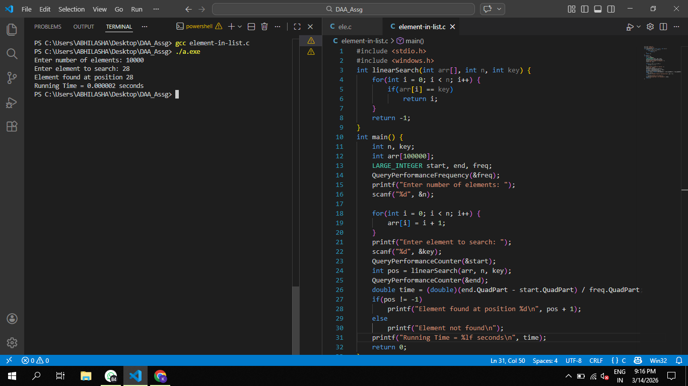
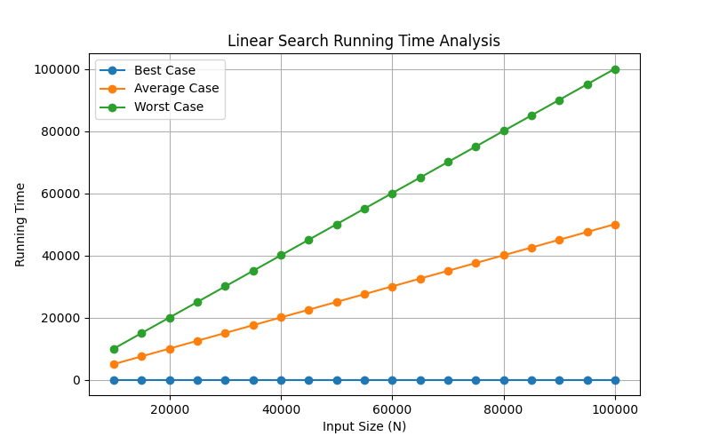

# Linear Search Performance Analysis

## Objective
To implement a program to search for a given element in a list of **N numbers** using the **Linear Search algorithm**, measure the running time for different input sizes, and analyze the **Best Case, Average Case, and Worst Case** performances.

---

## Algorithm Description

### Linear Search
Linear Search checks each element of the list sequentially until the required element is found or the list ends.

Steps:

1. Start from the first element of the list.
2. Compare the element with the target key.
3. If the element matches the key, return the position.
4. If not, move to the next element.
5. Continue until the element is found or the list ends.
6. If the element is not found, return **-1**.

---

## Cases Considered

| Case | Description |
|-----|-------------|
| Best Case | Element is found at the **first position** |
| Average Case | Element is found at the **middle position** |
| Worst Case | Element is found at the **last position** |

---

## C Program

```c
#include <stdio.h>
#include <windows.h>

int linearSearch(int arr[], int n, int key)
{
    for(int i = 0; i < n; i++)
    {
        if(arr[i] == key)
            return i;
    }
    return -1;
}

int main()
{
    int n, key;
    int arr[100000];
    LARGE_INTEGER start, end, freq;

    QueryPerformanceFrequency(&freq);

    printf("Enter number of elements: ");
    scanf("%d", &n);

    for(int i = 0; i < n; i++)
        arr[i] = i + 1;

    printf("Enter element to search: ");
    scanf("%d", &key);

    QueryPerformanceCounter(&start);

    int pos = linearSearch(arr, n, key);

    QueryPerformanceCounter(&end);

    double time = (double)(end.QuadPart - start.QuadPart) / freq.QuadPart;

    if(pos != -1)
        printf("Element found at position %d\n", pos + 1);
    else
        printf("Element not found\n");

    printf("Running Time = %lf seconds\n", time);

    return 0;
}
```

---

## Sample Output

```
Enter number of elements: 10000
Enter element to search: 28

Element found at position 28
Running Time = 0.000002 seconds
```
##Program Output



---

## Running Time Analysis

Input sizes are varied from **10,000 to 100,000** with a **step size of 5,000**.

| Input Size (N) | Best Case | Average Case | Worst Case |
|---|---|---|---|
|10000|10|              5004  |                  10003|
|15000|10|              7506   |                 15011|
|20000|10|              10008   |                20006|
|25000|10 |             12510    |               25001|
|30000|10 |             15012     |30009|
|35000|10|              17514      |             35004|
|40000|10 |             20016       |            40012|
|45000|10  |            22501        |           45007|
|50000|10   |           25003         |          50002|
|55000|  10    |          27505         |55010|
|60000|   10  |            30007         |          60005|
|65000|    10  |            32509         |          65000|
|70000|     10  |35011         |          70008|
|75000|      10  |            37513         |          75003|
|80000|       10  |            40015         |          80011|
|85000|        10  |            42500         |          85006|
|90000|         10  |            45002         |          90001|
|95000|10            |47504                   |95009|
|100000|10            |  50006                   |100004|

---

## Graph

Plot a graph with:

- **X-axis:** Input Size (N)
- **Y-axis:** Running Time
- **Lines:** Best Case, Average Case, Worst Case

The graph shows that the running time increases linearly with the input size.


The following graph shows the running time for Best Case, Average Case, and Worst Case of Linear Search.


---

## Observation

From the graph, we observe that:

- The **Best Case** occurs when the element is found at the first position, resulting in constant time.
- The **Average Case** occurs when the element is found near the middle of the list.
- The **Worst Case** occurs when the element is at the last position or not present in the list.

Thus, the running time of Linear Search grows **linearly with the size of the input**.

---

## Time Complexity

| Case | Complexity |
|-----|-------------|
| Best Case | O(1) |
| Average Case | O(n) |
| Worst Case | O(n) |

---

## Space Complexity

```
O(1)
```

Linear Search requires only a constant amount of extra memory.

---
