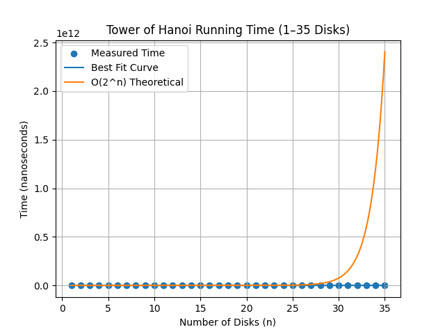

# Tower of Hanoi Performance Analysis

## Objective

To implement the Tower of Hanoi algorithm and analyze the running time for different numbers of disks.

---

## Algorithm Description

Tower of Hanoi is a classic recursive problem involving three rods and n disks.

Rules:

1 Only one disk can be moved at a time

2 A larger disk cannot be placed on a smaller disk

3 All disks must be moved from source rod to destination rod

Recursive Steps

1 Move n-1 disks from source to auxiliary rod

2 Move the largest disk to destination

3 Move n-1 disks from auxiliary to destination

---

## Recurrence Relation

T(n) = 2T(n-1) + 1

Solution:

T(n) = 2ⁿ - 1

---

## Time Complexity

Tower of Hanoi requires exponential time.

Time Complexity = **O(2ⁿ)**

---

## Program Output

Example output
.png)

---

## Graph

---

## Observation

Running time increases exponentially as the number of disks increases. Even a small increase in disks causes a large increase in execution time.

---

## Maximum Number of Disks

The program could run successfully up to **35 disks** on the machine used for the experiment.

---

## Conclusion

Tower of Hanoi demonstrates exponential time complexity. It becomes impractical for large inputs due to the rapid growth in the number of required moves.
