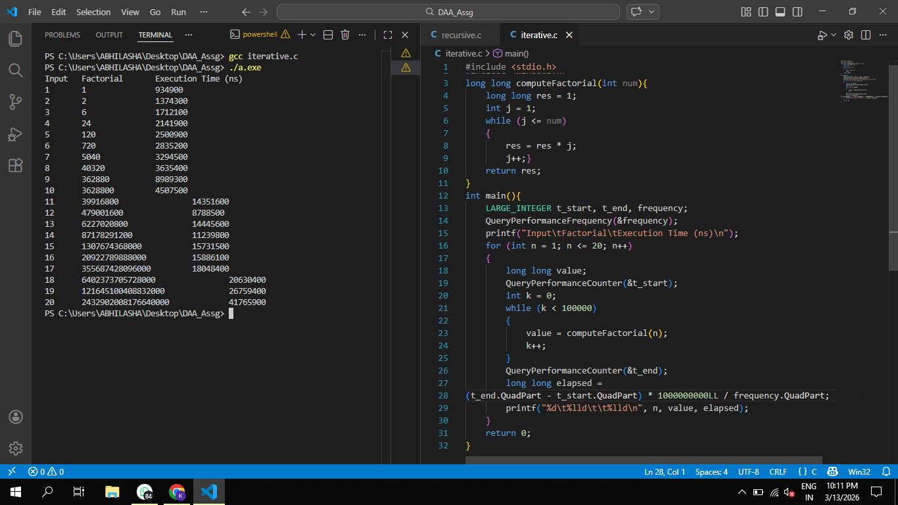
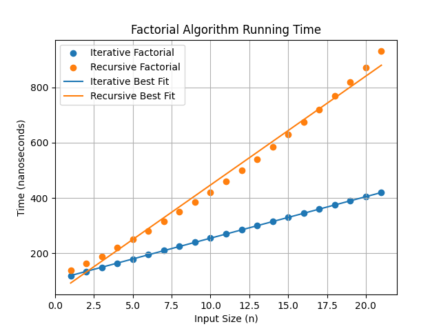

# Factorial Performance Analysis (Recursive vs Iterative)

## Objective

To implement factorial using recursive and iterative approaches and analyze the running time for different input sizes.

---

## Algorithm Description

### Recursive Factorial

Factorial is calculated by repeatedly calling the same function.

Base condition:
0! = 1

Recursive relation:
n! = n × (n−1)!

The function continues calling itself until it reaches the base case.

---

### Iterative Factorial

Factorial can also be computed using a loop.

Steps:
1. Initialize result = 1
2. Multiply result with every integer from 1 to n
3. Return the result

---

## Time Complexity

Recursive Factorial  
T(n) = O(n)

Iterative Factorial  
T(n) = O(n)

Although both algorithms have the same complexity, recursion introduces additional overhead due to function calls and stack usage.

---

## Program Output

Example output produced for input sizes from 1 to 29 with step 2.

---

## Graph

Factorial Running Time Graph

---

## Observation

The running time increases linearly as the input size increases.  
The recursive implementation consistently takes slightly more time than the iterative implementation due to the overhead of function calls.

---

## Conclusion

Both implementations correctly compute factorial values with linear time complexity O(n).  
The iterative version is more efficient in practice because it avoids recursion overhead and stack operations.
